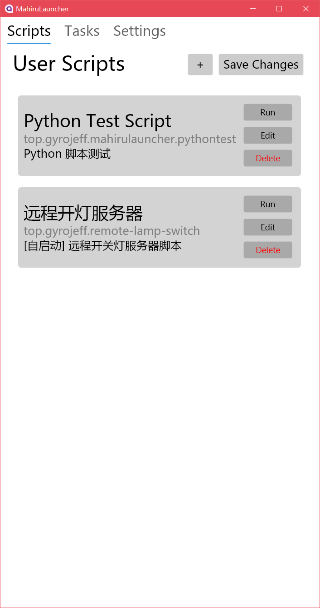
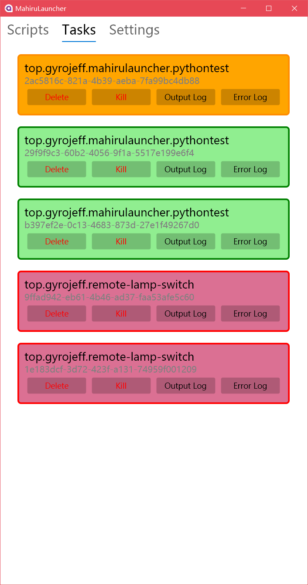
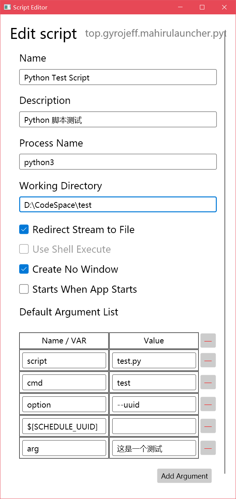

# MahiruLauncher

跨平台脚本管理启动器

## Introduction

首先介绍这个工具里的两个概念：

* Script: 配置的脚本
* Task: 运行的任务

Task 可以由 Script 点击 Run 直接新建并运行，也可以由发送 POST 请求到 Server 产生，参见 Server API Section

### Script

配置字段：

* Name: 脚本名称
* Identifier: 脚本 ID
* Description: 脚本简介
* Process Name (File Name): 进程名 / (二进制)文件路径
* Working Directory: 工作目录
* Redirect Stream to File (启用本选项则无法 Use Shell to Execute): 是否重定向 stdout 和 stderr 到文件
* Use Shell Execute: 使用 Shell 执行
* Create No Window: **不**产生窗口
* Starts when App Starts: 工具启动时自动创建任务执行 (适用于 server 类的脚本)
* Default Argument List 默认参数列表
  * Name / Var: 参数名称 / 描述，或者调用程序提供的变量 (如活动任务的 uuid)
  * Value: 参数值

### Task

每个 Task 由多种状态：

* Success [Green]: 脚本像服务器汇报成功执行
* Waiting [White]: 没有开始执行 (常见于任务创建失败时)
* Error [Red]: 没有汇报成功便终止了进程
* Running [Blue]: 执行中
* Killed [Orange]: 用户手动终止

### Special Var

* `$[SCHEDULE_UUID]`: 当前任务的 `uuid`

## Server API

### GET `/finish/{id}`

* 说明：汇报 uuid 为 `{id}` 的任务已经**成功**完成，如果汇报但是脚本运行结束了就会把 task 判定为失败
* 参数：
  * `{id}`: 任务的 `uuid`
* 返回值格式: `json`
* 返回值字段：
  * `Status`: 状态, `"success"|"error"`
  * `Message`: 信息
* 返回值示例:
  ```json
  {
	  "Status": "success",
	  "Message": ""
  }
  ```
  ```json
  {
	  "Status": "error",
	  "Message": "task not found"
  }
  ```

### POST `/start`

* 说明：开始新的任务
* 表单参数：
  * `id`: 要启动的 Script 的 ID
  * `arguments`: json 格式的自定义参数列表（用于替换 Default Argument List 中的某些字段）
* 返回值格式: `json`
* 返回值字段：
  * `Status`: 状态, `"success"|"error"`
  * `Message`: 信息
* 返回值示例:
  ```json
  {
	  "Status": "success",
	  "Message": ""
  }
  ```

## Screenshots

<div align="center">
	
	
	
</div>

## TODO

- [ ] Drag & drop to run
- [ ] Import xml file as script
- [ ] Settings
- [ ] Scheduler (cron)
- [ ] Python library

## Technology Used

* [AvaloniaUI/Avalonia](https://github.com/AvaloniaUI/Avalonia)
* [unosquare/embedio](https://github.com/unosquare/embedio)
* [Jetbrains Rider](https://www.jetbrains.com/rider/)
